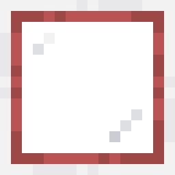

# Advanced Molecular Assemblers

Advanced Molecular Assemblers is an [Applied Energistics 2](https://github.com/AppliedEnergistics/Applied-Energistics-2) addon for Minecraft that adds tiered Molecular Assemblers capable of handling multiple crafting jobs in parallel.

## Features

- Five assembler tiers with 2, 4, 8, 16, or 32 independent crafting lanes.
- Round-robin job distribution from adjacent AE2 Pattern Providers.
- An AE2-style interface for switching between and inspecting lanes.
- Manual encoded-pattern and ingredient insertion for every lane.
- Ten Acceleration Card slots in a 2x5 upgrade panel.
- A two-job input queue per lane to reduce Pattern Provider bottlenecks.
- Persistent lane contents, queued jobs, patterns, progress, and upgrades.

Each lane is independent. A blocked output stops only that lane, and a lane with a manually inserted pattern remains reserved until the pattern is removed.

## Installation

1. Install NeoForge for Minecraft 26.1.2.
2. Install Applied Energistics 2.
3. Place the Advanced Molecular Assemblers JAR in the `mods` directory.

## Tiers and recipes

The 2x assembler is crafted from normal AE2 Molecular Assemblers. Every later recipe uses the preceding Advanced Molecular Assembler tier.

```text
Iron Ingot          Previous Tier     Iron Ingot
Annihilation Core   Previous Tier     Formation Core
Iron Ingot          Previous Tier     Iron Ingot
```

| Tier | Parallel lanes | Recipe ingredient |
| --- | ---: | --- |
| 2x | 2 | AE2 Molecular Assembler |
| 4x | 4 | 2x Molecular Assembler |
| 8x | 8 | 4x Molecular Assembler |
| 16x | 16 | 8x Molecular Assembler |
| 32x | 32 | 16x Molecular Assembler |

## Building from source

Clone the repository and run:

```powershell
.\gradlew.bat build
```

On Linux or macOS:

```bash
./gradlew build
```

Release artifacts are written to `build/libs`. The build also produces a complete corresponding-source archive.

## Project status

The project is currently at version **0.1.0**. Back up important worlds before testing prerelease builds and report reproducible problems through GitHub Issues.

## License

Copyright (c) 2026 DerDavidoo.

Advanced Molecular Assemblers is open-source software licensed under the [GNU Lesser General Public License version 3.0 only](LICENSE). Third-party attribution and adapted-asset information is available in [THIRD_PARTY_NOTICES.md](THIRD_PARTY_NOTICES.md).
